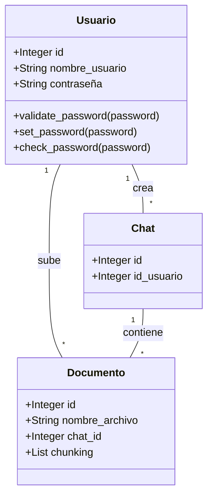

# App Web Notebook LM

## Ejecución de los Servicios en GCP

Con el fin de lograr ejecutar los servicios de manera correcta, debemos entender la arquitectura que desplegamos:


La arquitectura fue diseñada para desplegarse en Google Cloud Platform (GCP). Está compuesta por una VPC que contiene dos subredes con propósitos específicos. La primera subred utiliza el segmento 10.109.1.16/28 y está destinada a los componentes de backend y worker, mientras que la segunda subred (10.109.1.0/28) se especializa en el frontend. Esta división permite una estructura clara y un aislamiento adecuado entre los diferentes componentes del sistema.

En la primera subred se implementaron dos máquinas virtuales con funciones complementarias. La instancia-backend se encarga de ejecutar el microservicio principal del backend, actuando como el núcleo de procesamiento. Por otro lado, la worker-instance gestiona tareas especializadas como la lectura, transformación e inserción de vectores en la base de datos, además de interactuar con el modelo Gemini para el procesamiento avanzado de consultas. Esta subred también alberga dos bases de datos Cloud SQL: una relacional para la gestión de usuarios y otra vectorial para almacenar los embeddings generados a partir de los documentos. Adicionalmente, incorpora un servicio Filestore configurado como NFS y montado en la instancia-backend, proporcionando almacenamiento persistente para los documentos de los usuarios.

La segunda subred está dedicada exclusivamente al frontend, conteniendo la instancia-front que ejecuta el microservicio de interfaz de usuario. Esta separación física garantiza un mejor control de acceso y seguridad, al mismo tiempo que optimiza el rendimiento al especializar cada subred en un conjunto específico de funciones.

La arquitectura se complementa con servicios gestionados de GCP que potencian su funcionalidad. El Artifact Registry actúa como repositorio centralizado para las imágenes Docker utilizadas en los despliegues. El servicio Gemini se integra para proporcionar capacidades avanzadas de procesamiento de lenguaje natural. Finalmente, se implementaron reglas de firewall específicas para regular el tráfico entre las subredes, asegurando comunicaciones seguras y controladas.

### Replicar la arquitectura de GCP

Si deseamos montar todo desde cero en GCP se deben seguir los siguientes pasos:

##### 0. Redes

Se crea una Network VPC donde van a estar contenido el proyecto y se define de manera apropiada cada una de sus subredes: private-net y prublic-net.

##### 1. Imagenes

Con el fin de poder hacer un manejo eficiente de las imagenes en docker, se debe crear en GCP un 'Artifact Registry' donde se van a subir cada una de las imagenes. Para subirlas, se debe de manera local configurar el entorno, y luego haciendo referencia al 'tag' que deseamos subir a la nube realizar los siguientes comandos.

```bash
* gcloud auth activate-service-account --key-file=key.json
* gcloud auth configure-docker us-central1-docker.pkg.dev

* docker build -t <<name>>:latest -f <<name>>/<<name>>.dockerfile ./<<name>>
* docker tag <<name>>:latest us-central1-docker.pkg.dev/desarrollo-web-451923/cloud-images/<<name>>:latest
* docker push us-central1-docker.pkg.dev/desarrollo-web-451923/cloud-images/<<name>>:latest
```

NOTA: Ajustar 'backend' al nombre que se desea subir.
Se deben subir cada una de las imagenes necesarias del proyecto, las cuales se describen en la arquitectura de la aplicación.

##### 2. Cloud SQL

Como se describe en la arquitectura, el proyecto cuenta con dos bases de datos: una vectorial, para el amacenamiento correcto del vectores; y otra relacional, para la información de los usuarios y los chats. Estás bases de datos se definen como Cloud SQL con Postgres >> 15. Dentro, se debe definir el usuario por el cual se van a conectar a la base de datos, unicamente por la IP Privada.

Este usuario creado, debe contar con todos los permisos necesarios. Para eso, desde el usuario 'postgres' correr:

```bash
GRANT USAGE ON ALL SEQUENCES IN SCHEMA <<NOMBRE_DEL_ESQUEMA>> TO <<NOMBRE_DEL_USUARIO>>;
GRANT SELECT, INSERT, UPDATE, DELETE ON ALL TABLES IN SCHEMA <<NOMBRE_DEL_ESQUEMA>> TO <<NOMBRE_DEL_USUARIO>>;
```

##### 3. Filestore

Además, como NDF usamos Filestore, el cual sigue una creación predeterminada. No obstante, luego de crear las maquinas virtuales se deberá corrar los siguientes comandos para el buen funcionamiento.

```bash
sudo apt-get update && sudo apt-get install -y nfs-common
sudo mkdir -p /mnt/filestore
sudo mount [IP_address]:/share_name /mnt/filestore
sudo nano /etc/fstab
[IP_address]:/share_name /mnt/filestore nfs defaults 0 0
```

##### 4. Maquinas Virtuales

A priori a cualquier cosa, durante la creación de la maquina virtual dadas las especificaciones necesarias debemos habilitar unos elementos puntuales:

1. Seleccionar la cuenta de 'Service Account' que tenga los siguientes permisos:

   - Artifact Registry Reader
   - Editor
   - Service Usage Admin
   - Read/Write Cloud SQL
   - Read/Write Cloud Filestore

2. Configurar las reglas de firewall con el fin de permitir solo el trafico deseado como se especifica
3. En Security habilitar el API: 'Cloud Platform'.

Esto es necesario para que la maquina permita conectividad, tanto con otras maquinas, como con los diferentes servicios que se van a consumir. Dentro de las maquinas virtuales el proceso general con el cual se pueden correr las imagenes es:

```bash
* sudo apt-get update
* sudo apt-get install -y docker.io docker-compose
* sudo docker network create ___specific______network
* gcloud auth configure-docker us-central1-docker.pkg.dev
* TOKEN=$(gcloud auth print-access-token)
        echo $TOKEN | sudo docker login -u oauth2accesstoken --password-stdin https://us-central1-docker.pkg.dev
```

##### 5. Correr Imagenes dentro de las Maquinas Virtuales

1. Frontend

Con el fin de correr de manera adecuada el frontend, debemos realizar un pequeño ajuste al momento de crear y subir su imagen en el artifact debido al funcionamiento de Vite. Para eso se corre:

```bash
docker build --no-cache -t frontend:latest --build-arg VITE_API_BASE_URL=http://<<URL_PUBLIC_BACKEND>>:8000 -f frontend/frontend.dockerfile ./frontend
```

Una vez es subida, podemos correr (siempre y cuando la ruta de la imagen sea correcta):

```bash
sudo docker run -d \
        --name frontend \
        --network public_network \
        -p 3000:3000 \
        us-central1-docker.pkg.dev/desarrollo-web-451923/cloud-images/frontend:latest
```

2. Backend

Con en el fin de que corra de manera adecuada debemos pasar varias variables de enterno, descritas por los servicios que consume:

```bash
sudo docker run -d \
        --name backend \
        --network private_network \
        -p 8000:8000 \
        -e POSTGRES_DB=USER \
        -e POSTGRES_USER=team5 \
        -e POSTGRES_PASSWORD=Project2025! \
        -e POSTGRES_PORT=5432 \
        -e POSTGRES_HOST=relational_db \
        -e DATABASE_URL='postgresql+psycopg2://team5:Project2025!@<<Private_IP_Cloud_SQL>>:5432/USER' \
        -e SECRET_KEY=secret \
        -e FRONTEND_URL=http://<<Public_IP_Frontend>>:3000 \
        -e DOCUMENT_URL=http://<<Private_IP_Worker>>:8001 \
        -e PROMPT_URL=http://<<Private_IP_Worker>>:8003 \
        -v /mnt/filestore:/mnt/filestore:rw \
        us-central1-docker.pkg.dev/desarrollo-web-451923/cloud-images/backend:latest
```

3. Worker

Dada la gran cantidad de imagenes que corren en simultaneo en esta VM, realizamos la configuración por medio de un Docker-Compose el cual se debe

- Crear con Nano dentro de la maquina virtual.
- Quemar el API de Gemini.

```bash
nano docker-compose_gcp_worker.yml
```

Este, debe contener:

```bash
services:

# -----------------------------------------------------------------------------
# Augment
# -----------------------------------------------------------------------------
  augment:
    container_name: augment
    image: us-central1-docker.pkg.dev/desarrollo-web-451923/cloud-images/aumentador:latest
    ports:
      - "2000:2000"
    environment:
      - API_KEY=
    depends_on:
      - retriever
    networks:
      - project_network
    volumes:
      - augment:/var/lib/augment/data
    restart: always

# -----------------------------------------------------------------------------
# Chunking
# -----------------------------------------------------------------------------
  chunking:
    image: us-central1-docker.pkg.dev/desarrollo-web-451923/cloud-images/chunking:latest
    container_name: chunking_service
    ports:
      - "8001:8001"
    networks:
      - project_network
# -----------------------------------------------------------------------------
# Embeddings
# -----------------------------------------------------------------------------
  embeddings:
    container_name: embeddings
    image: us-central1-docker.pkg.dev/desarrollo-web-451923/cloud-images/embeddings:latest
    ports:
      - "8002:8002"
    networks:
      - project_network
  embeddings2:
    container_name: embeddings_service_2
    image: us-central1-docker.pkg.dev/desarrollo-web-451923/cloud-images/embeddings:latest
    ports:
      - "8003:8002"
    networks:
      - project_network
# -----------------------------------------------------------------------------
# Retriever
# -----------------------------------------------------------------------------
  retriever:
    container_name: retriever
    image: us-central1-docker.pkg.dev/desarrollo-web-451923/cloud-images/retriever:latest
    ports:
      - "8080:8080"
    networks:
      - project_network
    volumes:
      - retriever:/var/lib/retriever/data
    restart: always
# -----------------------------------------------------------------------------
# NETWORKS & VOLUMES
# -----------------------------------------------------------------------------

networks:
  project_network:
    driver: bridge

volumes:
  embeddings:
    driver: local
  chunking:
    driver: local
  retriever:
    driver: local
  augment:
    driver: local
```

Una vez está listo, para correlo se debe:

```bash
docker-compose -f docker-compose_gcp_worker.yml up -d
```

##### 6. Correr

Dado que todos los servicios están montados con los permisos adecuados, la aplicación va a estar corriendo en:

```bash
http://<<IP_PUBLICA_FRONTEND>>:3000
```

## Historias de usuario

### 1. Carga de Documentos

- **Como usuario, quiero subir documentos en formato PDF de máximo 5MB, para que la aplicación pueda analizarlos.**  
  **Criterios:**

  1. El usuario puede subir archivos en formato PDF de 5MB.

- **Como usuario, quiero que antes de realizar preguntas al LLM en el chat, se exija que este subido un documento.**  
  **Criterios:**

  1. La aplicación bloquea la funcionalidad de preguntas si no hay un documento cargado.
  2. Se muestra un mensaje indicando que se debe subir un documento antes de realizar preguntas.

- **Como usuario, quiero recibir un mensaje en el chat cuando mi documento se haya procesado correctamente, para saber cuándo puedo revisarlo.**  
  **Criterios:**

  1. Se muestra un mensaje en el chat cuando el documento ha sido procesado exitosamente.
  2. Si ocurre un error en el procesamiento, se notifica al usuario.

- **Como usuario, quiero poder revisar un solo documento en cada chat que tenga.**  
  **Criterios:**
  1. Cada chat está asociado a un único documento.
  2. No es posible subir más de un documento por chat.

### 2. Procesamiento de Texto con IA

- **Como usuario, quiero hacer preguntas sobre el contenido de un documento y recibir respuestas precisas, para aclarar dudas de manera eficiente.**  
  **Criterios:**
  1. El usuario puede realizar preguntas sobre el documento cargado.
  2. La IA responde utilizando la información del documento.

### 3. Interfaz Web y API

- **Como usuario, quiero acceder a la aplicación desde una interfaz web, para gestionar mis chats.**  
  **Criterios:**
  1. La aplicación es accesible desde un navegador web.
  2. El usuario puede iniciar sesión y ver sus chats en la interfaz.

### 4. Gestión de Usuarios y Sesiones

- **Como usuario, quiero registrarme e iniciar sesión en la aplicación, lo cual me permita acceder a los chats.**  
  **Criterios:**

  1. El usuario puede registrarse con un usuario y contraseña.
  2. El sistema valida las credenciales al iniciar sesión.

- **Como usuario, quiero cerrar sesión en cualquier momento, para proteger mi privacidad.**  
  **Criterios:**

  1. Se proporciona un botón de "Cerrar sesión".

- **Como usuario, quiero ver mis chats, para consultar información de diferentes documentos.**  
  **Criterios:**

  1. Se muestra una lista de chats activos en la interfaz.
  2. Cada chat al que le puedo preguntar está asociado a un documento.

- **Como usuario, quiero poder crear tantos chats como yo considere necesarios.**  
  **Criterios:**

  1. No hay un límite en la cantidad de chats que el usuario puede crear.

- **Como usuario, quiero poder consultar las respuesta y preguntas realizada de los chats mientras tenga abierta la sesión (sin persistencia).**  
  **Criterios:**

  1. Las preguntas y respuestas permanecen visibles mientras la sesión esté activa.

- **Como usuario, quiero poder borrar los chats que considere que ya cumplieron su función de consulta.**  
  **Criterios:**
  1. Se proporciona una opción para eliminar chats individualmente.

### 5. Despliegue y Escalabilidad

- **Como administrador, quiero que la aplicación se ejecute en contenedores con Docker y Docker Compose, para facilitar el despliegue y la escalabilidad.**  
  **Criterios:**
  1. La aplicación se ejecuta en un contenedores Docker.
  2. Se proporciona un archivo docker-compose.yml para la orquestación de los servicios.

## Arquitectura de la Aplicación

La arquitectura de la aplicación está compuesta por 10 servicios, descritos a continuación:

1. **Frontend:** Es la capa de experiencia de usuario que gestiona la interacción del cliente con la interfaz gráfica. Permite acciones como iniciar sesión, registrarse y utilizar un chat interactivo, mediante el cual los usuarios pueden cargar documentos y realizar búsquedas específicas de información utilizando un modelo de inteligencia artificial.

2. **Embedding (1 y 2):** Esta capa genera los embeddings, convirtiendo el texto en vectores y llama a los servicios correspondientes una vez ya tenga los resultados convertidos en vectores.

   - **Embedding 1:** Produce embeddings de los chunks y los almacena en la base de datos vectorial.
   - **Embedding 2:** Convierte las preguntas en vectores y los envía al retriever para su procesamiento.
   - **Todos los vectores son de un tamaño fijo, igual 384 posiciones.**

3. **Chunking:** Este servicio divide el texto en chunks o fragmentos, estructurando la información antes de enviarla a Embedding 1 para generar embeddings y almacenarlos en la base de datos vectorial.

4. **Base de datos relacional:** Asegura la persistencia de la información del cliente, como los datos de registro y sus chats asociados.

5. **Base de datos vectorial:** Se encarga de almacenar los documentos cargados por los usuarios, el ID del chat, los embeddings y el texto asociado a cada vector.

6. **Retriever:** Realiza una similitud de coseno entre el prompt (consulta del cliente) y los textos almacenados durante la sesión (un solo chat especifico), devolviendo los fragmentos del documento que mejor se ajusta a la pregunta formulada.

7. **Augment:** Estructura la consulta que se enviará al modelo, recibe la respuesta del modelo y la remite, junto con la consulta original, al servicio del backend directamente.

8. **Backend:** Actúa como orquestador, conectando el frontend con las capas de datos y procesos, y asegurando la comunicación entre los servicios.

9. **Ollama:** Procesa las búsquedas solicitadas por el cliente en los documentos y proporciona una respuesta que se envía al servicio de Augment.

El flujo de la aplicación es el siguiente: un usuario inicia sesión en el frontend, abre un chat y, antes de poder realizar preguntas, debe subir un documento. Una vez cargado, el documento es dividido en fragmentos (chunking), procesado para generar sus embeddings y almacenado en la base de datos junto con el ID del chat. Finalmente, el usuario puede comenzar a hacer consultas.

Por otro lado, cuando el usuario realiza una consulta, la pregunta se envía al backend, donde es procesada y vectorizada mediante el servicio de embeddings. Una vez generado el vector, este se utiliza para buscar información relevante en el retriever, identificando los chunks mas relevantes con respecto a la pregunta. Luego, el contexto recuperado y la pregunta se combinan en el módulo de augmentation, que los envía al modelo de lenguaje (Gemini). El LLM genera una respuesta, la cual es devuelta al módulo de augmentation y finalmente con esto se tiene la respuesta para el front end.

## Limitaciones de la aplicación

- Los chat soportan más de un documento, pero está actualmente limitado a uno solo en la interfaz web.
- El tipo de documento debe ser PDF de máximo 5 MB.
- No se persiste el historial de chats una vez se cierra la interfaz web, se cierra o expira la sesión.

# UML de la Aplicación


